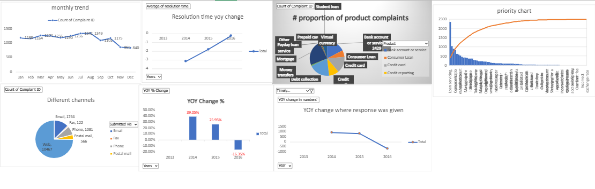

# 📊 Consumer Complaint Analysis & Resolution Dashboard

## 📌 Project Overview
This project analyzes financial consumer complaint data to identify trends, customer issues, and company response performance. The dashboard provides actionable insights to improve customer satisfaction and operational efficiency.

---

## 🎯 Objectives
- Analyze complaint patterns across products and companies
- Identify high complaint categories
- Evaluate timely response performance
- Understand dispute behavior

---

## 🧾 Dataset
- 14,000+ consumer complaint records
- Includes company, product, issue, state, submission method, and resolution status.

---

## 🛠️ Technologies Used
- Microsoft Excel
- Pivot Tables & Pivot Charts
- Data Cleaning
- Exploratory Data Analysis (EDA)
- Data Visualization

---

## 📊 Key Features
✅ Interactive Dashboard  
✅ Product-wise complaint analysis  
✅ State-wise distribution  
✅ Timely response tracking  
✅ Customer dispute insights  

---

## 📈 Key Insights
- Credit-related products generated highest complaints.
- Majority complaints submitted via web channels.
- Some companies showed delayed responses.
- Regional complaint concentration identified.

---

## 📷 Dashboard Preview

---

## 🚀 Future Improvements
- Machine Learning based dispute prediction
- Power BI interactive dashboard
- Automated reporting using Python

---

## 👩‍💻 Author
**MANISH SHARMA**
